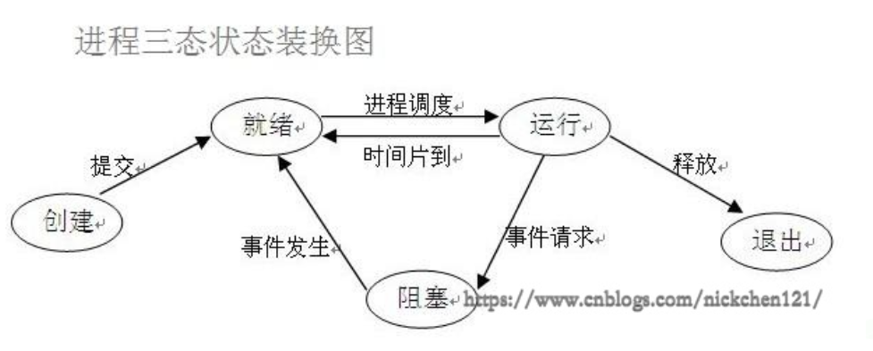

# 1：process thread 

## 基本概念

### **进程的概念**

1. 进程是一个实体。每一个进程都有它自己的地址空间，一般情况下，包括文本区域（text region）、数据区域（data region）和堆栈（stack region）。文本区域存储处理器执行的代码；数据区域存储变量和进程执行期间使用的动态分配的内存；堆栈区域存储着活动过程调用的指令和本地变量。
2. 进程是一个“执行中的程序”。程序是一个没有生命的实体，只有处理器赋予程序生命时（操作系统执行之），它才能成为一个活动的实体，我们称其为进程。

**进程的特征：**3

- 动态性：进程的实质是程序在多道程序系统中的一次执行过程，进程是动态产生，动态消亡的。
- 并发性：任何进程都可以同其他进程一起并发执行
- 独立性：进程是一个能独立运行的基本单位，同时也是系统分配资源和调度的独立单位；
- 异步性：由于进程间的相互制约，使进程具有执行的间断性，即进程按各自独立的、不可预知的速度向前推进
- 结构特征：进程由程序、数据和进程控制块三部分组成

进程与程序中的区别：

程序是指令和数据的有序集合，其本身没有任何运行的含义，是一个静态的概念。而进程是程序在处理机上的一次执行过程，它是一个动态的概念。

程序可以作为一种软件资料长期存在，而进程是有一定生命期的。

程序是永久的，进程是暂时的。

### **进程调度：**

1. FCFS 先来先服务，，该算法既可用于作业调度，也可用于进程调度。FCFS算法比较有利于长作业（进程），而不利于短作业（进程）。由此可知，本算法适合于CPU繁忙型作业，而不利于I/O繁忙型的作业（进程）。
2. SJ/PF 短作业（进程）优先调度算法是指对短作业或短进程优先调度的算法，该算法既可用于作业调度，也可用于进程调度。但其对长作业不利；不能保证紧迫性作业（进程）被及时处理；作业的长短只是被估算出来的
3. Round Robin，RR) 基本思路是让每个进程在就绪队列中的等待时间与享受服务的时间成比例,轮转法只能用来调度分配一些可以抢占的资源。这些可以抢占的资源可以随时被剥夺，而且可以将它们再分配给别的进程。CPU是可抢占资源的一种。但打印机等资源是不可抢占的。由于作业调度是对除了CPU之外的所有系统硬件资源的分配，其中包含有不可抢占资源，所以作业调度不使用轮转法。
4. 多级反馈队列
   1. 应设置多个就绪队列，并为各个队列赋予不同的优先级。第一个队列的优先级最高，第二个队列次之，其余各队列的优先权逐个降低。该算法赋予各个队列中进程执行时间片的大小也各不相同，在优先权愈高的队列中，为每个进程所规定的执行时间片就愈小。例如，第二个队列的时间片要比第一个队列的时间片长一倍，……，第i+1个队列的时间片要比第i个队列的时间片长一倍。
   2. 当一个新进程进入内存后，首先将它放入第一队列的末尾，按FCFS原则排队等待调度。当轮到该进程执行时，如它能在该时间片内完成，便可准备撤离系统；如果它在一个时间片结束时尚未完成，调度程序便将该进程转入第二队列的末尾，再同样地按FCFS原则等待调度执行；如果它在第二队列中运行一个时间片后仍未完成，再依次将它放入第三队列，……，如此下去，当一个长作业(进程)从第一队列依次降到第n队列后，在第n 队列便采取按时间片轮转的方式运行。
   3. 仅当第一队列空闲时，调度程序才调度第二队列中的进程运行；仅当第1～(i-1)队列均空时，才会调度第i队列中的进程运行。如果处理机正在第i队列中为某进程服务时，又有新进程进入优先权较高的队列(第1～(i-1)中的任何一个队列)，则此时新进程将抢占正在运行进程的处理机，即由调度程序把正在运行的进程放回到第i队列的末尾，把处理机分配给新到的高优先权进程。

### 进程的并行和并发

**并行:** 并行是指两者同时执行，比如赛跑，两个人都在不停的往前跑；（资源够用，比如三个线程，四核的CPU ）

**并发:** 并发是指资源有限的情况下，两者交替轮流使用资源，比如一段路(单核CPU资源)同时只能过一个人，A走一段后，让给B，B用完继续给A ，交替使用，目的是提高效率。

### 并行和并发的区别

并行是从微观上，也就是在一个精确的时间片刻，有不同的程序在执行，这就要求必须有多个处理器。

并发是从宏观上，在一个时间段上可以看出是同时执行的，比如一个服务器同时处理多个session。

### 状态介绍

在程序运行的过程中，由于被操作系统的调度算法控制，程序会进入几个状态：就绪，运行和阻塞

1. 就绪(Ready)状态：当进程已分配到除CPU以外的所有必要的资源，只要获得处理机便可立即执行，这时的进程状态称为就绪状态。
2. 执行/运行（Running）状态当进程已获得处理机，其程序正在处理机上执行，此时的进程状态称为执行状态。
3. 阻塞(Blocked)状态正在执行的进程，由于等待某个事件发生而无法执行时，便放弃处理机而处于阻塞状态。引起进程阻塞的事件可有多种，例如，等待I/O完成、申请缓冲区不能满足、等待信件(信号)等。

### 同步和异步

**同步**就是一个任务的完成需要依赖另外一个任务时，只有等待被依赖的任务完成后，依赖的任务才能算完成，这是一种可靠的任务序列。要么成功都成功，失败都失败，两个任务的状态可以保持一致。

**异步**是不需要等待被依赖的任务完成，只是通知被依赖的任务要完成什么工作，依赖的任务也立即执行，只要自己完成了整个任务就算完成了。至于被依赖的任务最终是否真正完成，依赖它的任务无法确定，所以它是不可靠的任务序列。

### 阻塞和非阻塞

阻塞和非阻塞这两个概念与程序（线程）等待消息通知(无所谓同步或者异步)时的状态有关。也就是说阻塞与非阻塞主要是程序（线程）等待消息通知时的状态角度来说的

同步阻塞

异步阻塞

同步非阻塞

异步非阻塞

### 守护进程

会随着主进程的结束而结束。

**进程之间是互相独立的，主进程代码运行结束，守护进程随即终止。**

主进程创建守护进程

　　其一：守护进程会在主进程代码执行结束后就终止

　　其二：守护进程内无法再开启子进程,否则抛出异常：`AssertionError: daemonic processes are not allowed to have children`

lock

加锁可以保证多个进程修改同一块数据时，**同一时间只能有一个任务可以进行修**改，即串行的修改，没错，速度是慢了，但牺牲了速度却保证了数据安全。

因此我们最好找寻一种解决方案能够兼顾：

1. 效率高（多个进程共享一块内存的数据）
2. 帮我们处理好锁问题。这就是mutiprocessing模块为我们提供的基于消息的**IPC通信机制：队列和管道**。

消息传递的并发编程是大势所趋

~~~python
from multiprocessing import Process ,Lock
lock.acquire() # 加锁
lock.release() 

Process :
    
参数介绍：
    group参数未使用，值始终为None
    target表示调用对象，即子进程要执行的任务
    args表示调用对象的位置参数元组，args=(1,2,'egon',)
    kwargs表示调用对象的字典，kwargs={'name':'egon','age':18}
    name为子进程的名称  
    
方法：
	p.start()：启动进程，并调用该子进程中的p.run()
	p.run()：进程启动时运行的方法，正是它去调用target指定的函数
	p.terminate()：强制终止进程p，不会进行任何清理操作，如果p创建了子进程，该子进程就成了僵尸进程，使用该方法需要特别小心这种情况。如果p还保存了一个锁那么也将不会被释放，进而导致死锁
	p.is_alive()：如果p仍然运行，返回True
	p.join()：主线程等待p终止（强调：是主线程处于等的状态，而p是处于运行的状态）。timeout是可选的超时时间，需要强调的是，p.join只能join住start开启的进程，而不能join住run开启的进程

属性：
	p.daemon：默认值为False，如果设为True，代表p为后台运行的守护进程，当p的父进程终止时，p也随之终止，并且设定为True后，p不能创建自己的新进程，必须在p.start()之前设置
	p.name：进程的名称
	p.pid：进程的pid
	p.exitcode：进程在运行时为None、如果为–N，表示被信号N结束(了解即可)
	p.authkey：进程的身份验证键,默认是由os.urandom()随机生成的32字符的字符串。这个键的用途是为涉及网络连接的底层进程间通信提供安全性，这类连接只有在具有相同的身份验证键时才能成功（了解即可）

~~~

程序的异步，让多个任务可以同时在几个进程中并发处理，他们之间的运行没有顺序，一旦开启也不受我们控制。尽管并发编程让我们能更加充分的利用IO资源，但是也给我们带来了新的问题：当多个进程使用同一份数据资源的时候，就会引发数据安全或顺序混乱问题。

但进程间应该尽量避免通信，即便需要通信，也应该选择进程安全的工具来避免加锁带来的问题

#### Manager