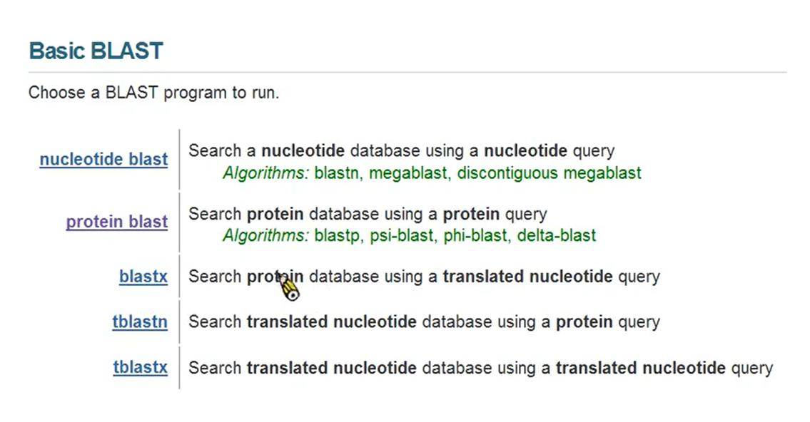
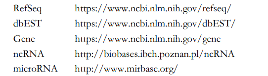
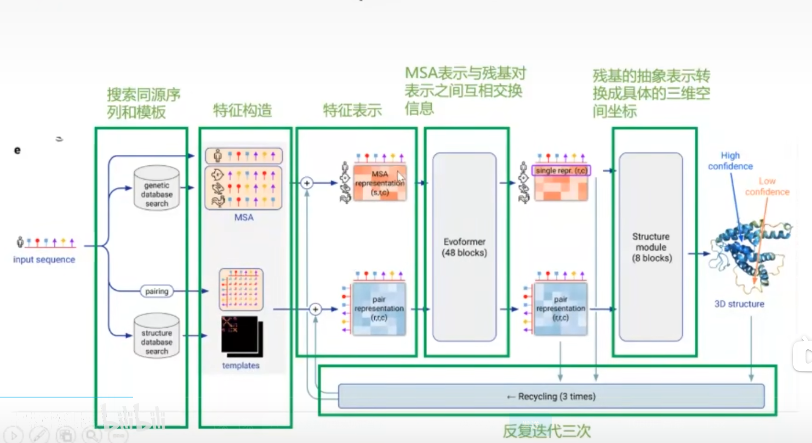

工作-学习

## 1： 基本生物知识

核酸种类：

1. 脱氧核糖核酸 DNA
2. 核糖核酸 RNA

核酸的组成元素： C，H，O，N，P

核酸的基本组成单位：核苷酸

核苷酸：  一分子磷酸 一分子含氮碱基 一分子五碳糖（DNA 脱氧核糖，RNA核糖）

1. DNA： 脱氧核糖核苷酸
2. RNA： 核糖核苷酸

DNA： A（腺嘌呤） ，G（鸟嘌呤），C（胞嘧啶），T（胸腺嘧啶）

RNA： A，G，C，U（尿嘧啶）

DNA的复制：

- 全保留复制：新复制出的分子直接形成，完全没有旧的部分
- 半保留复制：形成的分子一半是新的，一半是旧的


dNTP :	脱氧核糖核苷酸  通过磷酸二酯键连接形成DNA链

ddNTP :	双脱氧核糖核苷酸 的2'和3'位置都不含羟基，ddNTP只能通过磷酸基团形成一个磷酸二酯键而无法在向下延伸使合成反应中断

## 台湾大学


Alignment: 对齐

PAM scoring matrices 

Blosum62


gloab local alignment :


local alignment:

smith-waterman 


Heuristic Search Algorithms : 启发式算法

FASTA：

BLAST

idea:  true alignments will have a short stretch of identity (perfect match)

同源的蛋白质序列，应用有一段很小的序列完全匹配



蛋白质结构：


扭角 


## 数据库

分类：

- 核酸数据库
- 蛋白质数据库
- 专用数据库


三大核酸序列数据

- GenBank 数据库（是NCBI 中的一个）
- EMBL
- DDBJ


PubMed **http://www.ncbi.nlm.nih.gov/pubmed**   生物医学文献的数据库

NCBI： **http://www.ncbi.nlm.nih.gov**

Ensembl ：  **http://www.ensembl.org ** **基因组数据库**

**微生物宏基因组数据库 JCVI**  **http://www.jcvi.org/**



### UMLS

1. (1)超级叙词表(Metathesaurus),是UMLS知识源的核心,由来自各种受控词表的概念和术语以及它们之间的关系所构成;
2. (2)语义网络(Semantic Network),是对超级叙词表概念的分类和分类之间的关系;
3. (3)专家辞典(SPECIALIST Lexicon),是一个词典信息库,用于自然语言处理;
4. (4)支持性的软件工具,各种利用UMLS的工具和程序

Concept Unique Identifier： 统一概念 

语义网络： 

语义类型(Semantic Types)和语义关系(Semantic Relationships)

语义类型有135个,可分为实体(Entity)和事件(Event)两大类

语义类型是分层次的,因此具有等级关系：  


专家辞典及工具：SPECIALIST Lexicon


超级词表：

[概念结构: CUI-LUI-SUI-AUI ](https://links.jianshu.com/go?to=https%3A%2F%2Fzhuanlan.zhihu.com%2Fp%2F359377333)

CUI是概念的唯一标识符

LUI是概念的同义词

SUI是不同术语（LUI）所拥有的不同的英语表达形式（单复数/过去式/...）

AUI是原词


### UniPort 

供了定期更新的、详尽的、高质量的、有功能标记（functional annotation）的蛋白质序列库。

UniProtKB 包含两类序列：

（1）Reviewed UniProtKB / Swiss-Prot entries

（2）Unreviewed UniProtKB / TrEMBL entries


### SRC & MERC


### Metaclust

作者用 Linclust 聚类了从2200个宏基因组和宏转录组数据集预测的15.9亿条蛋白质序列片段，获得4.24 亿个聚类，这些聚类的代表结构组成了 Metaclust 蛋白序列库。

## 序列比对工具

### MMSeqs

MMSeqs 的全称是 **m**any-against-**m**any **seq**uences **s**earching， 意为“多序列对多序列的搜索”

（1）prefilter module：快速敏感地比较 query & target 序列，获得相似 **k-mers** 的打分；

（2）alignment module：排列、对齐打分后的序列；

（3）clustering module：使用贪心算法，逐级聚类对齐序列。

### **BLOSUM**

**blo**ck **su**bstitution **m**atrix ,氨基酸替换打分矩阵


### FAMSA


我们的讨论都局限于如何处理序列（比较相似度、排列对齐、聚类），获得的是 MSA，


https://zhuanlan.zhihu.com/p/423064843#:~:text=%E6%88%91%E8%AF%B4%E7%9A%84%E5%BD%93%E7%84%B6%E6%98%AF%20AlphaFold2%20%E6%89%80%E4%BD%BF%E7%94%A8%E7%9A%84%E8%9B%8B%E7%99%BD%E8%B4%A8%E5%BA%8F%E5%88%97%E6%95%B0%E6%8D%AE%E5%BA%93%20Big%20Fantastic%20Database%20%EF%BC%88BFD%EF%BC%89%EF%BC%8C%E6%88%91%E5%8F%AB%E5%AE%83%E2%80%9C%20%E5%A4%A7%E8%B6%85%E5%87%A1,%E2%80%9D%E3%80%82%20AlphaFold2%20%E6%A8%A1%E5%9E%8B%E7%9A%84%E6%95%B0%E6%8D%AE%E5%9F%BA%E7%A1%80%E6%98%AF%E7%B2%BE%E5%BF%83%E9%80%89%E6%8B%A9%E3%80%81%E8%B0%83%E8%AF%95%E7%9A%84%E5%BA%8F%E5%88%97%E5%BA%93%E5%92%8C%E4%B8%89%E7%BB%B4%E7%BB%93%E6%9E%84%E5%BA%93%EF%BC%8C%20%E5%A4%A7%E8%B6%85%E5%87%A1%20%E5%B0%B1%E6%98%AF%E7%94%B1%E6%96%87%E7%AB%A0%E7%9A%84%E7%AC%AC25%E4%BD%9C%E8%80%85%20Martin%20Steinegger%20%EF%BC%88M.S.%EF%BC%89%E6%9E%84%E5%BB%BA%E7%9A%84%E5%BA%8F%E5%88%97%E6%95%B0%E6%8D%AE%E5%BA%93%E3%80%82


## 基于测序：

### 1代测序： Sanger 测序

[双脱氧终止法](https://www.zhihu.com/search?q=双脱氧终止法&search_source=Entity&hybrid_search_source=Entity&hybrid_search_extra={"sourceType"%3A"article"%2C"sourceId"%3A"94183808"})


**Sanger 测序法原理**

**构建反应系统**

[Sanger法测序](https://www.zhihu.com/search?q=Sanger法测序&search_source=Entity&hybrid_search_source=Entity&hybrid_search_extra={"sourceType"%3A"article"%2C"sourceId"%3A"94183808"})由一套四个单独的反应构成，每个反应系统包含

1. 四种[脱氧核苷酸三磷酸](https://www.zhihu.com/search?q=脱氧核苷酸三磷酸&search_source=Entity&hybrid_search_source=Entity&hybrid_search_extra={"sourceType"%3A"article"%2C"sourceId"%3A"94183808"}) (dNTP)，可以正常合成DNA
2. 每个反应系统加入四种不同的[双脱氧核苷三磷酸](https://www.zhihu.com/search?q=双脱氧核苷三磷酸&search_source=Entity&hybrid_search_source=Entity&hybrid_search_extra={"sourceType"%3A"article"%2C"sourceId"%3A"94183808"}) (ddNTP)，由于ddNTP缺乏延伸所需要的3-OH基团，使延长的[寡聚核苷酸](https://www.zhihu.com/search?q=寡聚核苷酸&search_source=Entity&hybrid_search_source=Entity&hybrid_search_extra={"sourceType"%3A"article"%2C"sourceId"%3A"94183808"})选择性地在G、A、T或C处终止，另外为了方便定位，需要用荧光或者同位素标记。
3. 目标片段、DNA聚合酶、引物，反应体系

**扩增目的片段**

下一步进行扩增，以目的片段为模板，在DNA聚合酶的催化下，从引物处起始开始复制DNA，当遇到ddNTP，反应停止

控制 dNTP 与 ddNTP 相对浓度，可以调节扩增的浓度

**[凝胶电泳](https://www.zhihu.com/search?q=凝胶电泳&search_source=Entity&hybrid_search_source=Entity&hybrid_search_extra={"sourceType"%3A"article"%2C"sourceId"%3A"94183808"})**

**序列读取**

### 2 illumina 测序

https://www.cn-healthcare.com/articlewm/20210110/content-1179325.html

1： Library Preparation  文库制备

DNA 片段的一个集合，将测序片段打断之后构成了一个DNA文库


2： Cluster Generation 族生成

3： Sequencing 测序

4： Data Analysis


## 蛋白质

**蛋白质的一级结构指的是蛋白质多肽链中氨基酸残基的排列顺序，包括二硫键的位置，也是蛋白质最基本的结构**


蛋白质的二级结构：多肽链上的主链有规则的折叠方式，包括α-螺旋，β-折叠,β-转角 ，无规则卷曲，Ω环等。靠氢键维持

蛋白质的三级结构：是在二级结构的基础上进一步盘绕、折叠形成。是蛋白质分子处于它的天然折叠状态的三维构象，其主要靠氨基酸侧链之间的疏水作用力、氢键、范德华力和静电作用来维持（非共价键）。

蛋白质的四级结构：主要靠次级键（非共价键）维持。


**多态 的单字母书写：**

~~~
 ①多肽序列1: G T F L V R C D M A，共10个氨基酸，所有字母均是大写，则表示所有的氨基酸均是天然存在的L型氨基酸。
②多肽序列2：G T F L v R C d M A，共10个氨基酸，序列里面有两个氨基酸是小写，说明对应的两个氨基酸是D型氨基酸。
③多肽序列1：G T F L V R C D M A 也可以写成H-G T F L V R C D M A-OH，左边的H- 代表N端的氨基，右边的-OH 代表C端的羧基。不过一般通常为了美观整齐，H-和-OH同时写或同时不写。
④多肽序列3：G T F L V R C D M A-NH2，与多肽序列1的区别是，右边多了-NH2，代表C端酰胺化。

⑤多肽序列4：AC-G T F L V R C D M A,与多肽序列1的区别是，左边多-AC，代表N端乙酰化。
~~~

**多肽的三字母书写形式**

**多肽的三字母书写形式**

~~~
三个字母代表一个氨基酸，并且三字母和前面提到的单字母是一一对应关系
①多肽序列1对应的三字母书写为：H-Gly-Thr-Phe-Leu-Val-Cys-Asp-Met-Ala-OH.
②多肽序列3对应的三字母书写为：H-Gly-Thr-Phe-Leu-Val-Cys-Asp-Met-Ala-NH2，C端酰胺化。

③多肽序列4对应的三字母书写：Ac-Gly-Thr-Phe-Leu-Val-Cys-Asp-Met-Ala-OH左边多-Ac，代表N端乙酰化。

DNA-RNA-蛋白质，并指出蛋白质是由DNA转录为RNA,再由RNA翻译成一个个氨基酸组合而成的，因此蛋白质的一级氨基酸序列信息应该包含了蛋白质三维空间结构的必要重要信息。
~~~


**特殊多肽序列的书写**

~~~
例如：磷酸化氨基酸的书写，

①：H-Gly-pThr-Phe-Leu-Val-Cys-Asp-Met-Ala-OH

②：H-Gly-Thr(PO3H2)-Phe-Leu-Val-Cys-Asp-Met-Ala-OH
~~~

homology ： 同源

similarity： 相似

[序列比对](https://zhuanlan.zhihu.com/p/437654967)

两个序列：DP  pair-wise alignments 

多序列：  启发式  multiple alogrithms 


如两条序列的相似程度达到30%或60%。一般来说，相似性很高的两条序列往往具有同源关系。但也有例外，即两条序列的相似性很高，但它们可能并不是同源序列，这两条序列的相似性可能是由随机因素所产生的，这在进化上称为“趋同”（convergence），这样一对序列可称为**同功序列。**

### 序列比对

**全局比对（Global alignment）**和**局部比对（Local alignment）**

序列比对分为**序列两两比对**和**多序列比对**。

 替换计分矩阵【氨基酸替换矩阵】

**BLOSUM** score matrix【blocks substitution matrix】

**PAM** score matrix，**位置特异性矩阵PSSM**


多序列比对算法

是指两个或多个序列按字母比较，尽可能确切地反映它们之间的相似和相异性，用于阐明序列之间的同源关系。通过序列比对，找出序列之间的相似性，发现与结构相联系的保守序列片段，以及检测新测定序列与数据库中已知结构和功能的序列之间的相似性关系，从而以足够的可信度确定新序列的结构和功能信息。

#### 双序列比对：

1. 动态规划的优化方法
2. 启发式算法
3. 大型数据库搜索设计的概率方法

Needleman-Wunsch算法是最早的序列比对算法，属于全局序列比对

Smith-Waterman算法是一种局部相似性的动态规划算法，在识别局部相似性时具有很高的灵敏度，是双序列比对算法中最基本的算法

启发式算法

FASTA算法

BLAST算法

PSI-BLAST 

Next Generation Sequencing :  

Advantage : long reads 

Disadvatage : high cost 

potemtial problem :  long mononucleotide  repeats 


### 形成稳定分子结构所参与作用的力

- 骨架链：连续的肽键
- 侧链：R基团
- α螺旋/β折叠/β转角/无规则卷曲
- 氢键/范德华力/二硫键/残基的带点性质（盐桥）/疏水性

### 目前观测蛋白质空间结构的方法

实验观测：

- X-ray
- 冷冻电镜
- 核磁共振
- 中子散射


相似性90%以上的氨基酸序列的MSA没什么意义，因为太像了，留一条就够了；相似性30%以下的氨基酸序列MSA也没什么意义，因为太不像了很可能不是同源的。


## Data pipeline


AlphaFold的运行流程如下：

- 在CPU上运行hhblits,jackhmmer,hhsearch等工具搜索数据库
- 在GPU上运行Tensorflow代码构造输入特征
- 在GPU上运行jax代码，运行训练好的深度学习模型，分别运行5个模型，得到5个PDB结构和对应的置信度分数
- 使用CPU运行amber relax去除violation并加上氢原子
- 得到基于pLDDT排序的五个模型


## AlphaFold

的特征提取包含了**序列特征**和**序列平方特征**两大部分。

https://zhuanlan.zhihu.com/p/464232665

https://zhuanlan.zhihu.com/p/539157126

http://www.knightofnight.com/archives/alphafold2%E9%98%85%E8%AF%BB%E7%AC%94%E8%AE%B0

https://zhuanlan.zhihu.com/p/464232665

~~~
序列特征是长度和原始输入序列相同的，包括了one-hot[3]的氨基酸种类特征（21维）,HHblit[4]特征（22维），MSA[2]特征等等

1:了one-hot[3]的氨基酸种类特征
2:其中HHblit[4]特征代表HHblit工具算法对每个氨基酸计算出的一个特征向量，可以理解为类似NLP中的embedding的概念

3:MSA是(Multiple Sequence Alignment) 多序列对齐
抽取这个特征的原因是类似的氨基酸序列一般来说折叠方式也类似，相当于在特征中就加入了相近的序列结构信息


~~~


~~~markdown
input： 氨基酸 sequence 
output: 氨基酸两两之间的距离分布和夹角

input feature:
one-hot: 氨基酸种类特征（21维）
HHblit特征（22维） : embedding 只不过这个embedding是用了很多先验知识算出来的，而不是学出来的
MSA特征

预测蛋白质的3D结构比较难，先预测Contact map 作为限制来优化蛋白质的折叠
蛋白质的二维表示：Contact Map Distance Map

预测蛋白质的Contact Map 理论基础：
序列保守信息 ： 在不同物种中同一个位置的氨基酸不变
序列的共进化信息：两个不同位置的氨基酸同步变化 
aplpha 第一代： 预测的是一个二维结构 然后优化 ResNet

构建不同列氨基酸之间的相关性，这可以学习到蛋白质的phylogeny信息。和wise是类似的操作。
~~~


## 蛋白质结构预测：

1. all the information necessary  for protein folding into its native structure is encoded in its amino acid sequence 
2. Proteins fold into minimun energy status 
3. Most proteins fold into a unique conformation 

Method :

Template-based modeling  (基于模板的) PDB

Template-free modeling 


~~~
大家下午好，今天我分享的是alphafold2 ，一种经过计算预测蛋白质空间结构的方法，在座各位都是这个领域的大佬，在关公面前耍大刀了，后面有讲的不对的地方，或者有问题，可以补充。
~~~

```
SOURCE_URL="https://storage.googleapis.com/alphafold/alphafold_params_2022-03-02.tar"
```





```
conda config --remove-key channels 
conda config --show channels

conda config --add channels https://mirrors.tuna.tsinghua.edu.cn/anaconda/pkgs/free/
conda config --add channels https://mirrors.tuna.tsinghua.edu.cn/anaconda/pkgs/main/
conda config --set show_channel_urls yes
比如 

pip install tensorboard
# 阿里镜像源
conda config --add channels https://mirrors.aliyun.com/pypi/simple/
# 豆瓣的python的源
conda config --add channels http://pypi.douban.com/simple/ 
conda config --set show_channel_urls yes

conda install pytorch==1.7.1 torchvision==0.8.2 torchaudio==0.7.2 cudatoolkit=11.0 -c pytorch
conda install  --index-url https://pypi.douban.com/simple 
opencv-python
pip install --index-url https://pypi.douban.com/simple  pandas
pycocotools-windows
torchvision==0.8.2
pycocotools-windows
tf-slim==1.1.0
Pytorch1.7.1
tensorflow==2.2.0 
pip install tensorflow==2.7.0 
pip install tf-slim==1.1.0
opencv-python
matplotlib
pip install opencv-python pandas
https://pjreddie.com/media/files/yolov2-tiny-voc.weights

# 本地项目打包
pip install --user torch==1.7.1 torchvision==0.8.2 -f https://download.pytorch.org/whl/torch_stable.html -i http://pypi.douban.com/simple/ --trusted-host pypi.douban.com

pip install conda-pack
conda pack -n fastercnn2 -o A:\11_code\fastercnn\fastercnn.tar.gz

```

~~~
X-ray、冷冻电镜、核磁共振

source ~/.bash  # 进入系统环境
~~~


## 抗体

抗体是脊椎动物为应对外来入侵蛋白（抗原），保护机体不被伤害而分泌的、在体内进行循环的蛋白质分子，是机体体液免疫的主要参与者

抗体又被称为免疫球蛋白（immunoglobulin，Ig） （一类糖蛋白）

```
SOURCE_URL="https://storage.googleapis.com/alphafold-databases/reduced_dbs/bfd-first_non_consensus_sequences.fasta.gz"
```

只能通过B细胞系的相关细胞产生：

分泌型和膜结合型

在体内抗体主要通过两个功能实现对病原清除

1. 抗体可以识别并特异性的结合外来病原，这样的结合足以使病原或者毒素失去活性
2. 抗体在体内和病原结合后，还可以通过Fc和FcR信号通路引发后续的一系列免疫反应，介导对入侵外来抗原的清除，这些免疫反应包括补体系统的激活、吞噬系统的激活、ADCC等作用

**抗体的Ig结构**

抗体的单体是一个Y形的分子

抗体整体由四条多肽链构成，分别为两条结构相同的轻链（L chain）和两条结构相同的重链（H chain），四条链形成典型的“Y”型抗体结构

*抗体的轻链包含2个Ig结构域，分别为V domain（VL）和C domain（CL）*

重链的4个Ig结构域分别为VH、CH1、CH2和CH3。


Fab（fragment antigen binding）片段包括全部的轻链结构和重链的VH和CH1结构域

一个蛋白片段能够很快的形成结晶，被称为Fc片段，Fc是fragment crystallizable的首字母,对应的是抗体两条重链的CH2和CH3结构域

Fab还需要通过一个蛋白片段和Fc进行连接，这个蛋白片段被称为抗体的hinge结构域


disulfude bonds  二硫键

effector region 

- **抗体的亚型**

  IgG、IgM、IgA、IgD和IgE五种亚型

  通常情况下，一个抗体的两条重链和轻链是相同的两条链，但是IgG4在某些情况下可以和其它的IgG4交换重链，产生杂合抗体；杂合抗体的Fc是相似的，但是Fab不相同，因此严格说抗体的两条轻链和重链并不一定完全相同。


氨基酸序列研究显示，抗体（以IgG为例）轻链的C末端和重链的C末端约3/4的结构都是高度保守的，被称为保守区域（Constant region）而对应的轻链的N末端和重链的N末端，有着极高的氨基酸序列多样性，被称为可变区（Variant region）；在这些可变区域内分布着相对短的序列，表现出极强的多样性，被称为高频突变区域，这样的序列在轻链和重链的可变区分别有三个，被称为CDR（complementarity determining regions，CDRs)，随后的研究证明这些序列和抗体特异性的识别抗原相关。


## 抗原

抗原（antigen，缩写Ag）是指能引起抗体生成的物质，是任何可诱发免疫反应的物质。


知识

https://blog.csdn.net/qq_45493596/article/details/124903920?spm=1001.2101.3001.6661.1&utm_medium=distribute.pc_relevant_t0.none-task-blog-2%7Edefault%7ECTRLIST%7ERate-1-124903920-blog-122561714.pc_relevant_multi_platform_whitelistv3&depth_1-utm_source=distribute.pc_relevant_t0.none-task-blog-2%7Edefault%7ECTRLIST%7ERate-1-124903920-blog-122561714.pc_relevant_multi_platform_whitelistv3&utm_relevant_index=1

## 附录

~~~
https://github.com/lingluodlut/BioNER-Progress
https://zhuanlan.zhihu.com/p/330510520 # 抗体 
http://www.detaibio.com/topics/antibody-structure.html
pip install tensorboard

https://github.com/lingluodlut/BioNER-Progress


https://zhuanlan.zhihu.com/p/423064843#:~:text=%E6%88%91%E8%AF%B4%E7%9A%84%E5%BD%93%E7%84%B6%E6%98%AF%20AlphaFold2%20%E6%89%80%E4%BD%BF%E7%94%A8%E7%9A%84%E8%9B%8B%E7%99%BD%E8%B4%A8%E5%BA%8F%E5%88%97%E6%95%B0%E6%8D%AE%E5%BA%93%20Big%20Fantastic%20Database%20%EF%BC%88BFD%EF%BC%89%EF%BC%8C%E6%88%91%E5%8F%AB%E5%AE%83%E2%80%9C%20%E5%A4%A7%E8%B6%85%E5%87%A1,%E2%80%9D%E3%80%82%20AlphaFold2%20%E6%A8%A1%E5%9E%8B%E7%9A%84%E6%95%B0%E6%8D%AE%E5%9F%BA%E7%A1%80%E6%98%AF%E7%B2%BE%E5%BF%83%E9%80%89%E6%8B%A9%E3%80%81%E8%B0%83%E8%AF%95%E7%9A%84%E5%BA%8F%E5%88%97%E5%BA%93%E5%92%8C%E4%B8%89%E7%BB%B4%E7%BB%93%E6%9E%84%E5%BA%93%EF%BC%8C%20%E5%A4%A7%E8%B6%85%E5%87%A1%20%E5%B0%B1%E6%98%AF%E7%94%B1%E6%96%87%E7%AB%A0%E7%9A%84%E7%AC%AC25%E4%BD%9C%E8%80%85%20Martin%20Steinegger%20%EF%BC%88M.S.%EF%BC%89%E6%9E%84%E5%BB%BA%E7%9A%84%E5%BA%8F%E5%88%97%E6%95%B0%E6%8D%AE%E5%BA%93%E3%80%82
~~~


## NER

它的目的是从大量的非结构化医学文本中找出基因、疾病、蛋白质等相应的医学实体边界，然后再经过标准化映射到受控词汇表中，从而方便进行文献挖掘的下游任务。

1. 遗传性非息肉性结直肠癌综合征   很长的词汇组成
2. Zolmitriptan, Zomig and Zomigon  这三个名词都是表示同一实体
3. 生物医学实体通常由数字和字母缩写组成，有时相同的字母可能表示不同的意思

深度学习需要大量的高质量的已标注的数据集 ，数据集的大小和质量严重影响着最终的识别效果

这些方法分成4个类别，分别是：基于神经网络、基于多任务、基于迁移学习、基于混合模型的方法


## word

~~~
residue  残留物
~~~


~~~
http://epub.sipo.gov.cn/index.action 国家知识产权局专利公布公告
http://www.wipo.int/ - WIPO专利信息检索 (只包含WIPO的专利)
http://patft.uspto.gov - 美国专利商标局官方网站
http://ep.espacenet.com - 欧洲专利局旗下专利检索
https://www.epo.org/searching-for-patents/technical/espacenet.html
~~~

~~~
免费代理IP http://ip.yqie.com/ipproxy.htm
66免费代理网 http://www.66ip.cn/
89免费代理 http://www.89ip.cn/
无忧代理 http://www.data5u.com/
云代理 http://www.ip3366.net/
快代理 https://www.kuaidaili.com/free/
极速专享代理 http://www.superfastip.com/
HTTP代理IP https://www.xicidaili.com/wt/
小舒代理 http://www.xsdaili.com
西拉免费代理IP http://www.xiladaili.com/
小幻HTTP代理 https://ip.ihuan.me/
全网代理IP http://www.goubanjia.com/
飞龙代理IP http://www.feilongip.com/
————————————————
版权声明：本文为CSDN博主「专业技术人员继续教育学习助手」的原创文章，遵循CC 4.0 BY-SA版权协议，转载请附上原文出处链接及本声明。
原文链接：https://blog.csdn.net/u013661953/article/details/107560431
~~~

~~~
patent_num: Patent Number 专利号
patent_date: Issue Date 发行日期
abstract: Abstract 摘要
inventors: List of Names of Inventors and Their Locations 发明人名单及其所在地
applicant_name: Applicant Name Application _ Name: 申请人名称
applicant_city: Applicant City Application _ City: 申请城市
applicant_state: Applicant State (申请国)
applicant_country: Applicant Country 申请人国家: 申请人国家
assignee_name: Assignee Name Assignee _ Name: Assignee Name
assignee_loc: Assignee Location Assignee _ loc: Asignee Location
family_id: Family ID Family _ ID: Family ID
applicant_num: Applicant Number Application _ num: 申请人编号
file_date: Filing date File _ date: 归档日期
claims: Claims Description (as a list) 索赔说明(列表)
description: Patent Description (as a list) 说明: 专利说明(列表)
~~~


~~~
要是从google patents爬取专利基本信息， 并通过基本情况分析、研究方向划分、研究社区热度分析进行研究。
https://github.com/Jxyj/ThesisCode-Predict-hot-technology-direction-with-patents
~~~

~~~
update user set authentication_string=password("123456") where user="root";
~~~


数据库：

~~~

~~~

cv2.HoughCircles(gray, cv2.HOUGH_GRADIENT, 1, 200, param1=100, param2=30, minRadius=300, maxRadius=400)

若有n个圆形，则将检测输出n个（x,y,r）的向量，xy表示圆形坐标，r表示半径。


Canny边缘检测+霍夫圆识别图片中的圆形，由于霍夫圆的半径过滤不太稳定，当图中有多个圆时还要自行斟酌，如果是多个半径不同的圆，可以多次使用霍夫圆，并取第一个来识别。但是如果图中有多个半径相似的圆时，有必要转换方法或者提取更多细节来拟合或者霍夫圆

霍夫梯度法：


https://github.com/o0o0o0o0o0o0o/image-processing-from-scratch


https://www.freesion.com/article/38371116967/

# 图像基本运算

https://blog.csdn.net/asialee_bird/article/details/109463084

霍夫梯度法，


https://www.zhihu.com/search?q=%E5%9B%BE%E5%83%8F%E5%88%86%E5%89%B2%E6%9C%89%E4%BB%80%E4%B9%88%E7%94%A8&utm_content=search_suggestion&type=content


## 形态学

膨胀，腐蚀，开启，闭合

集合的交，并，补，差，反射，平移 


## 二值图像的逻辑运算 

not

and

or 

xor

前景 背景

目标检测：


分类算法：


## linux:

~~~
cat /etc/redhat-release
lscpu 
~~~


## 知识图谱 ：


# dash

学习资料：

~~~
https://www.cnblogs.com/feffery/p/14258438.html
https://www.jianshu.com/p/c34a2f8edf47


~~~


```bash
pip install dash
pip install dash-daq     # Dash核心后端

jupyter notebook
pip install jupyter_plotly_dash

conda install -c conda-forge jupyter-server-proxy
jupyter serverextension enable jupyter_server_proxy  # jupyter-server-proxy服务器扩展在安装时没有自动启用，这是一个依赖项jupyterlab-dash

```

1: 

**dash_core_components** 


~~~
app = dash.Dash(__name__)
布局 layout 由 html.Div 和 dcc.Graph 这样的组件树组成；
Dash是 声明式 的，通过关键字参数描述组件。即Dash主要通过属性描述应用，如 style、className、id等

~~~

~~~
app = JupyterDash('Hello Dash Style')
colors = dict(background = '#111111', text = '#7FDBFF')

app.layout = html.Div(
    style = dict(backgroundColor = colors['background']),
    children = [
        html.H1(
            children='你好，Dash',
            style = dict(textAlign = 'center', color = colors['text'])),
        html.Div(
            children='Dash：Python网络应用框架',
            style = dict(textAlign = 'center', color = colors['text'])),
        dcc.Graph(
            id='example-graph-2',
            figure = dict(
                data = [{'x': [1, 2, 3], 'y': [4, 1, 2], 'type': 'bar', 'name': '北京'},
                        {'x': [1, 2, 3], 'y': [2, 4, 5], 'type': 'bar', 'name': '天津'}],
                layout = dict(
                    plot_bgcolor = colors['background'], 
                    paper_bgcolor = colors['background'],
                    font = dict(color = colors['text'])
                )
            )
        )
    ]
)

~~~

~~~
交互式布局
滑动条
多重输入 	
多重输出	

loadding data 

state () 不促发回调 
多参数，按照顺序来
hover 
Storing Shared Data
1： user session
The data has to be converted to a string like JSON or base64 encoded binary data for storage
Data that is cached in this way will only be available in the user's current session
dcc.Store(id='intermediate-value') # 是存在session over 10Mb ,

~~~

# 图像增强：

~~~
https://github.com/zycskylove
https://github.com/kali20gakki/ObjectDetectionAssistant
https://github.com/ami66/yolov5_v6.0_object_detection
~~~

~~~
对图像进行缩放并进行长和宽的扭曲
对图像进行翻转
对图像进行色域扭曲

~~~


~~~
1： 图片预处理（随机改变明暗、对比度、颜色等）
import numpy as np
import cv2
from PIL import Image, ImageEnhance
import random

# 随机改变亮暗、对比度和颜色等
def random_distort(img):
    # 随机改变亮度
    def random_brightness(img, lower=0.5, upper=1.5):
        e = np.random.uniform(lower, upper)
        return ImageEnhance.Brightness(img).enhance(e)
    # 随机改变对比度
    def random_contrast(img, lower=0.5, upper=1.5):
        e = np.random.uniform(lower, upper)
        return ImageEnhance.Contrast(img).enhance(e)
    # 随机改变颜色
    def random_color(img, lower=0.5, upper=1.5):
        e = np.random.uniform(lower, upper)
        return ImageEnhance.Color(img).enhance(e)

    ops = [random_brightness, random_contrast, random_color]
    np.random.shuffle(ops)

    img = Image.fromarray(img)
    img = ops[0](img)
    img = ops[1](img)
    img = ops[2](img)
    img = np.asarray(img)

    return img
2： 随机填充
# 随机填充
def random_expand(img,
        gtboxes,
        max_ratio=4.,
        fill=None,
        keep_ratio=True,
        thresh=0.5):
    if random.random() > thresh:
        return img, gtboxes

    if max_ratio < 1.0:
        return img, gtboxes

    h, w, c = img.shape
    ratio_x = random.uniform(1, max_ratio)
    if keep_ratio:
        ratio_y = ratio_x
    else:
        ratio_y = random.uniform(1, max_ratio)
    oh = int(h * ratio_y)
    ow = int(w * ratio_x)
    off_x = random.randint(0, ow - w)
    off_y = random.randint(0, oh - h)

    out_img = np.zeros((oh, ow, c))
    if fill and len(fill) == c:
        for i in range(c):
            out_img[:, :, i] = fill[i] * 255.0

    out_img[off_y:off_y + h, off_x:off_x + w, :] = img
    gtboxes[:, 0] = ((gtboxes[:, 0] * w) + off_x) / float(ow)
    gtboxes[:, 1] = ((gtboxes[:, 1] * h) + off_y) / float(oh)
    gtboxes[:, 2] = gtboxes[:, 2] / ratio_x
    gtboxes[:, 3] = gtboxes[:, 3] / ratio_y

    return out_img.astype('uint8'), gtboxes
3随机裁剪 （这个涉及裁剪之后会不会裁掉过多的原本图像）
https://blog.csdn.net/qq_20491295/article/details/109312771#:~:text=bccd%E8%A1%80%E7%BB%86%E8%83%9E%E6%95%B0%E6%8D%AE%E9%9B%86%E6%98%AF%E4%B8%80%E4%B8%AA%E6%AF%94%E8%BE%83%E8%80%81%E7%9A%84%E6%95%B0%E6%8D%AE%E9%9B%86%EF%BC%8C%E4%B9%9F%E4%B8%8D%E5%A4%A7%EF%BC%8C%E5%8F%AF%E4%BB%A5%E5%9C%A8%E8%BF%99%E4%B8%8B%E8%BD%BD%20https%3A%2F%2Fpublic.roboflow.com%2Fobject-detection%2Fbccd,%E8%AF%A5%E6%95%B0%E6%8D%AE%E9%9B%86%E5%85%B1%E6%9C%89%E4%B8%89%E7%B1%BB364%E5%BC%A0%E5%9B%BE%E5%83%8F%EF%BC%9A%EF%BC%88WBC%E7%99%BD%E7%BB%86%E8%83%9E%EF%BC%89%EF%BC%8CRBC%EF%BC%88%E7%BA%A2%E7%BB%86%E8%83%9E%EF%BC%89%E5%92%8CPlatelets%E3%80%82%203%E4%B8%AA%E7%B1%BB%E5%88%AB%E4%B8%AD%E6%9C%894888%E4%B8%AA%E6%A0%87%E7%AD%BE%EF%BC%88%E6%9C%890%E4%B8%AA%E7%A9%BA%E7%A4%BA%E4%BE%8B%EF%BC%89%E3%80%82
~~~


~~~

conda create -n finace python=3.6

pip freeze > requirements.txt 
https://blog.csdn.net/adczsw/article/details/121983846 # 打包环境

~~~

 pip install --user torch==1.7.1 torchvision==0.8.2 -f https://download.pytorch.org/whl/torch_stable.html -i http://pypi.douban.com/simple/ --trusted-host pypi.douban.com

https://haicoder.net/docker/docker-run-mode.html

https://github.com/cosmicpython/book/blob/master/chapter_01_domain_model.asciidoc